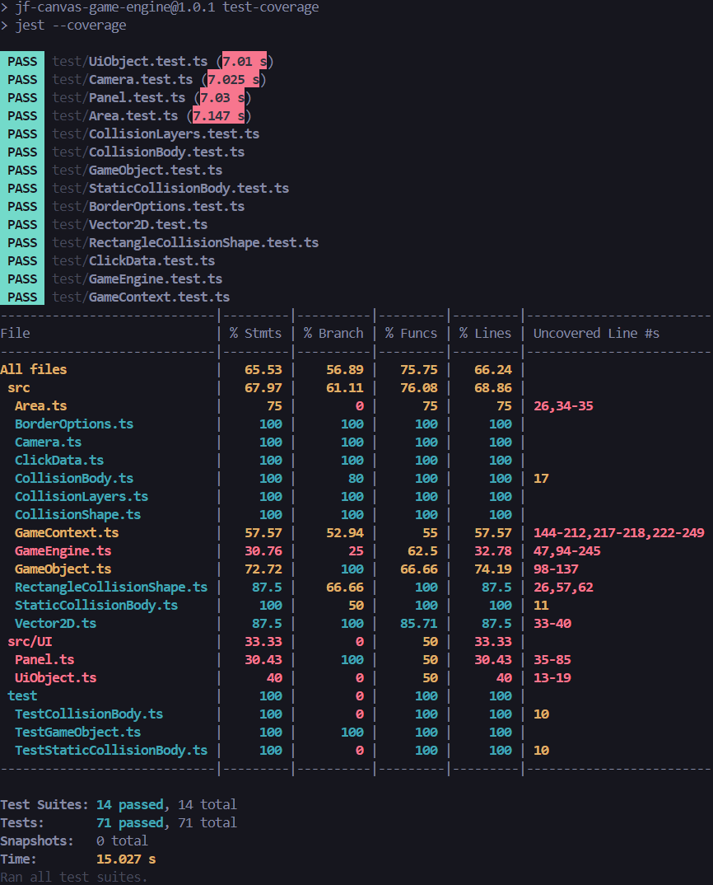

# Testrapport

### Vad som har testats

Majoriteten av de publika metoderna har testats. De publika metoder som inte har testats med enhetstester är de som har med EventListeners att göra utlösningen av event inte har fungerar. Draw och update samt render och process-metoderna har heller inte testats med enhetstester då draw och update enbart innehåller anrop till render och process på objektet och dess children, och render och process är tomma metoder menade att implementeras av användares subklasser. Man skulle eventuellt kunna köra tester för att se om och när de anropas, men har valt att göra så i detta fall.

### Hur testerna har utförts

Applikationen har testats genom enhetstester via test-verktyget jest. För de klasser som varit abstrakta har publika test-klasser skapats som ärver ifrån dessa. Det finns också argument för att inte testa abstrakta klasser då de inte är en del av det publika interfacet, coh man istället ska testa ge ärvda metoderna för alla subklasser. Men för enkelhetens skull och för att majoriteten av metoderna som rvs ner inte överskrivs av subklasser har jag valt att testa de abstakta klasserna.

### Resultat

_Figur 1: visar både testresultat och testcoverage_

Testrapporten visar att alla skriva tester har gått genom, men att testcoverage för viss klasser är på en låg nivå. En stor orsak till detta är att GameEngine till stor del består av privata metoder som anropas som en callback från window.requestAnimationFrame. Detta är en metod som inte går att testa med jest. Detta är en av anledningarna till att testcoverage är låg. En annan anledning är att jag inte har testat de metoder som anropas av eventlisteners, då jag inte har lyckats få dessa att fungera i testmiljö.
